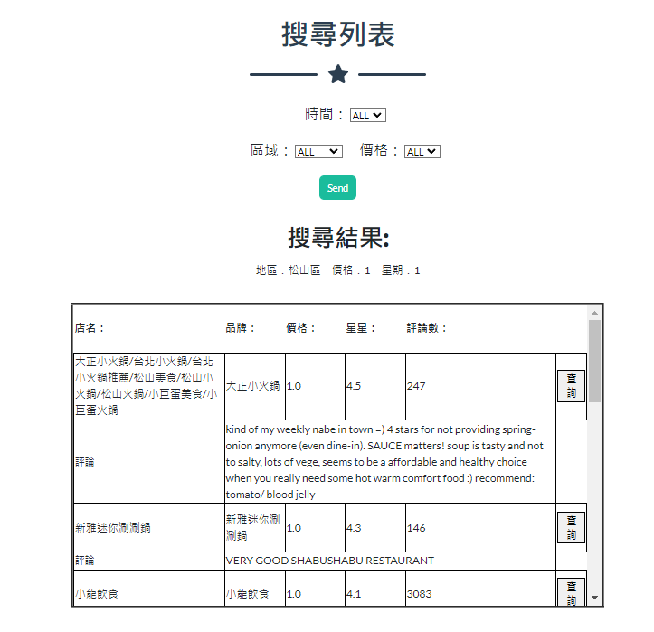

# 110學年度第一學期 資料庫系統期末專題


### **描述**
從Google爬取的資料放在documents/Scarper。</br>
建構火鍋Schema和將Google爬取的資料匯入到database裡的程式碼放在documents/json2sql。</br>
網頁前端程式碼放在codes。</br>

### **示範**
網頁內容請直接跑在codes/final底下的main.py

**執行方式** 
```
cd codes/final
python main.py
```
### **執行結果**

**網頁主頁面**


**搜尋結果**



**地圖顯示**


