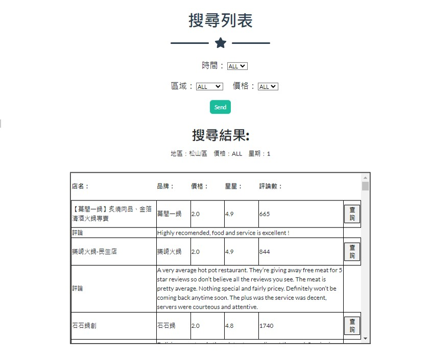
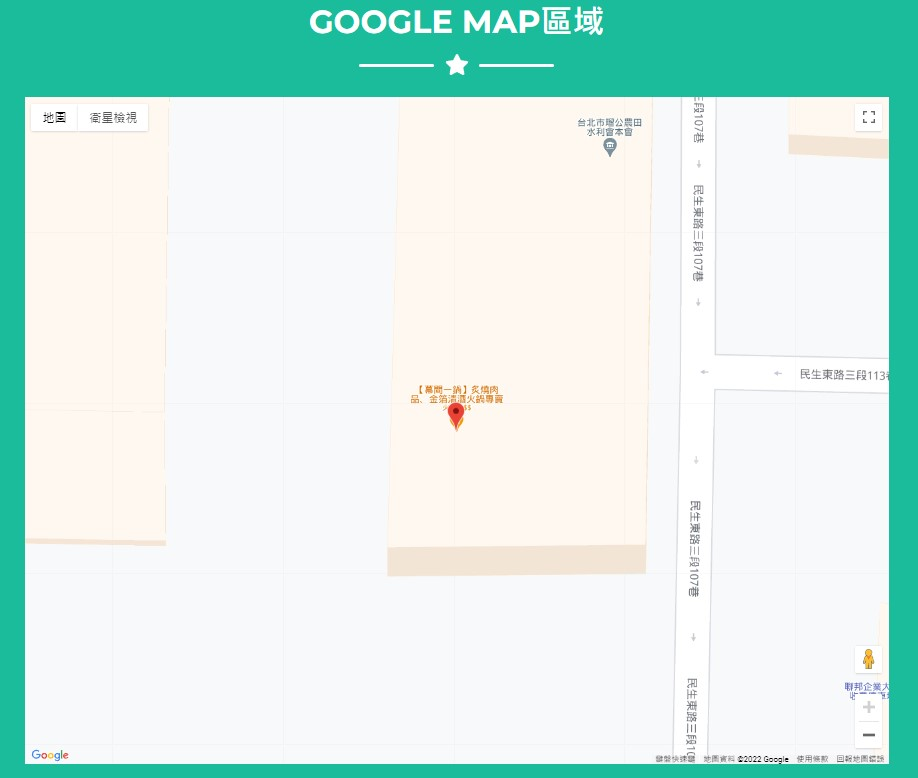

### **Description**
從Google爬取的資料放在documents/Scarper。
建構火鍋Schema和將Google爬取的資料匯入到database裡的程式碼放在documents/json2sql。
網頁前端程式碼放在codes。

### **Demo**
網頁內容請直接跑在codes/final底下的main.py
```
cd codes/final
python main.py
```

**網頁主頁面**


**搜尋結果**



**地圖顯示**


